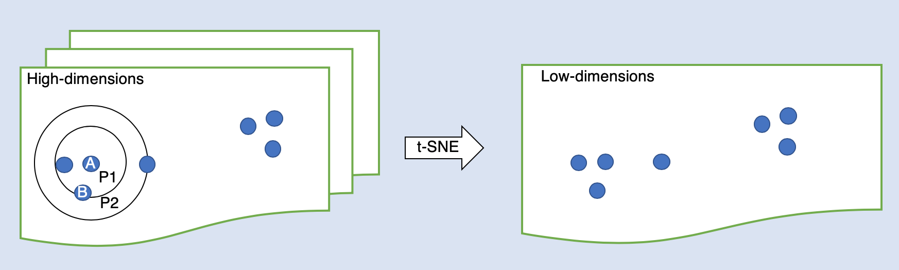
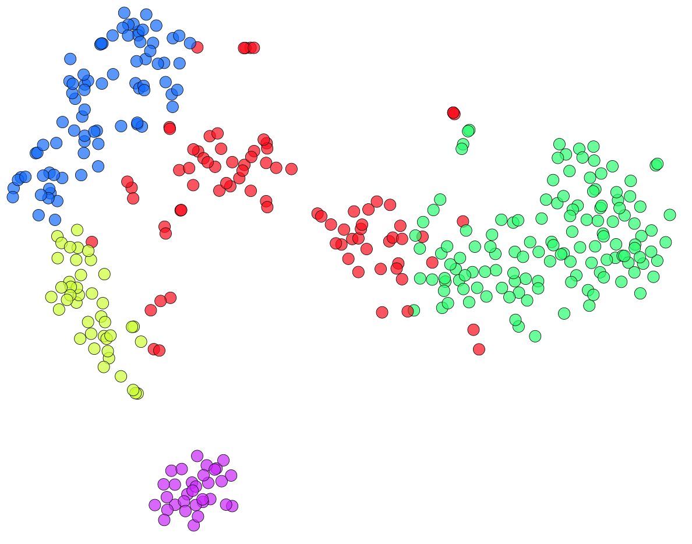

```{r setup, include=FALSE}
knitr::opts_chunk$set(echo = TRUE, fig.align = "center")
```

[This recent preprint](https://www.biorxiv.org/content/10.1101/2019.12.19.877522v1) and the subsequent [discussion on Twitter](https://twitter.com/hippopedoid/status/1207999178015727616) revealed holes in my understanding of t-distributed stochastic neighbor embedding (t-SNE) and it prompted me to dive deeper into the t-SNE algorithm and try to really understand the math behind it. In the spirit of the saying “when one teaches, two learn” I’ll give you an intuitive explanation of how t-SNE works and show you the effects of different t-SNE hyperparameters on the visualization. (By an intuitive explanation, I mean,  I won’t use any formulas to explain things.)  
&ensp;&ensp;&ensp;&ensp;&ensp;&ensp;Visualization tools are necessary to reveal patterns and the structure of dimensional data created by high-throughput technologies such as single-cell RNA-sequencing (scRNA-seq). The idea behind these tools is to make a 2D/3D plot in which distances between points represent underlying relationships in the original data. In practice, it is impossible to preserve all pairwise distances and thus the methods have to compromise which distances to preserve, and which to ignore. For example, t-SNE preserves local structure quite well, but global structure quite poorly. In the case of Principal Component Analysis (PCA) it's the opposite.  
&ensp;&ensp;&ensp;&ensp;&ensp;&ensp;Stochastic neighbor embedding (SNE), a method for visualization of high-dimensional data, was introduced in [2002 by Hinton and Roweis](https://www.cs.toronto.edu/~fritz/absps/sne.pdf). The algorithm starts by calculating the conditional probabilities that, for example, point A would pick point B as its neighbor if they were chosen in proportion to their probability density under a Gaussian (normal distribution) centered at A (Fig. 1.).

```{r echo = FALSE, message = FALSE, fig.show = "hold", out.width = "80%", fig.align = "center"}
#knitr::include_graphics("/post/01_tsne_explanation/figure_1.png")

```

Fig. 1. A hypothetical example of perfect low-dimensional embedding of seven points (blue) from a high-dimensional space. Circles represent Gaussian with different perplexity parameters (P1 and P2).

&ensp;&ensp;&ensp;&ensp;&ensp;&ensp;These conditional probabilities are basically the converted  high-dimensional Euclidean distances between the data points. It is possible to calculate the same probabilities for the low-dimensional counterparts of the high-dimensional datapoints and then measure the discrepancy between these probabilities. To measure the discrepancy between the similarities in the data and  in the plot we need some objective function. In SNE this it’s Kullback-Leibler (KL) divergence and a nice intuitive explanation can be found  [here](https://www.countbayesie.com/blog/2017/5/9/kullback-leibler-divergence-explained). The algorithm then aims at finding such representation of low-dimensional data points that minimizes the total sum of the discrepancies (for this it uses a gradient descent method). The KL divergence is the reason why SNE mainly preserves small pairwise distances (ie. local similarity structure of the data, and it’s happening due to the fact that KL divergence gives a big penalty when two very similar points in high-dimensional space are embedded far apart in low-dimensional space but not vice versa. If you check the formula in the [original paper](https://www.cs.toronto.edu/~fritz/absps/sne.pdf) you can easily understand why (I promised no formulas here)).  
&ensp;&ensp;&ensp;&ensp;&ensp;&ensp;t-SNE was developed in [2008 by Maaten and Hinton](http://www.jmlr.org/papers/volume9/vandermaaten08a/vandermaaten08a.pdf) and is based on the same idea as SNE. However, SNE suffers from something called ‘crowding problem’. For example, in 2D a point can have more neighbors in the same distance but imagine what happens when they embed in 1D. Exactly! Not enough room for all neighbors. This was solved in t-SNE by replacing the Gaussian with the Student’s t-distribution (therefore t-distributed SNE) to measure similarities in the low-dimensional space (in the heavy tailed Student’s t-distribution probability goes to zero slower than a Gaussian which “opens up more space for embedding”).  
&ensp;&ensp;&ensp;&ensp;&ensp;&ensp;One of the weaknesses of t-SNE is that it fails to preserve the global structure of the data. In [2019 Becht et al.](https://www.nature.com/articles/nbt.4314) suggested to use UMAP instead of t-SNE for an analysis of scRNA-seq data since they found UMAP to be superior at preserving the global distances. However, in a recent [preprint](https://www.biorxiv.org/content/10.1101/2019.12.19.877522v1), Kobak and Linderman demonstrated that this happened because of different initializations used for t-SNE (random initialization) and UMAP (initialization with Laplacian eigenmaps).  
&ensp;&ensp;&ensp;&ensp;&ensp;&ensp;In the reaction on this preprint [here](https://towardsdatascience.com/why-umap-is-superior-over-tsne-faa039c28e99) the author claims “As long as tSNE uses the KL divergence as a cost function, it cannot even in theory preserve global distances". However, the results of Kobak and Linderman’s preprint look quite convincing. My conclusion is that if you use t-SNE with suitable initialization and set the proper parameters, its performance is comparable to UMAP. In my opinion, the minor advantage of t-SNE over UMAP is that it doesn’t use as much white space in plots as UMAP does (example below in the Experimental playground).

## t-SNE hyperparameters
### Perplexity

From the original paper: “The perplexity can be interpreted as a smooth measure of the effective number of neighbors. The performance of SNE is fairly robust to changes in the perplexity, and typical values are between 5 and 50.“ Perplexity basically controls the width of the Gaussian kernel (Fig. 1.) and it can be said that it is dependent on the size of the dataset in the sense that large datasets require a larger perplexity. For example, [here](https://towardsdatascience.com/how-to-tune-hyperparameters-of-tsne-7c0596a18868) the author suggests to use perplexity = N**(1/2) where N is the number of samples in the dataset. An alternative strategy is to use a multi-scale approach (ie. using multiple perplexity values at the same time) as it might preserve both local and global structure better.

### Number of PCs

T-SNE has difficulty with high-dimensional data, therefore, it’s recommended to reduce dimensionality before analysis - for example with PCA - and using principal components (PCs) as the input for t-SNE. The question is how to select the optimal number of PCs? The default number of PCs to use for t-SNE in Rtsne R package is 50 and the same number was used by the authors [here](https://www.nature.com/articles/s41467-019-13056-x), arguing that the number of PCs doesn’t have much influence on t-SNE results. However, if you don’t select enough PCs you might lose the signal from the data, and on the contrary, with too many PCs you’ll include noise from the data. Thus, a more sophisticated approach to deciding how to select a number of significant PCs is via shuffling (more on this topic below in the Experimental playground).

### Learning rate

With this parameter, you can control how quickly the algorithm searches for the best solution. A low learning rate will cause the algorithm to search slowly and very carefully, however, it might get stuck in a local optimal solution. With a high learning rate the algorithm might never be able to find the best solution. The learning rate should be tuned based on the size of the dataset. [Here](https://www.nature.com/articles/s41467-019-13056-x) they suggest using learning rate = N/12.

### Initialization

Random initialization of t-SNE is a default option in the implementation of t-SNE in the Rtsne R package. However, when using random initialization, you have to set a random seed for reproducibility and the results then highly depend on that. Another approach that I will demonstrate is to use PCA initialization which makes the outcome of t-SNE reproducible and not dependent on a random seed.

## Experimental playground
### Small dataset

I chose an scRNA-seq dataset of developing adrenomedullary cells at embryonic day 12.5 (E12.5) containing 385 cells. This dataset comes from [(Furlan et al., 2017)](https://science.sciencemag.org/content/357/6346/eaal3753) who described the developmental trajectory of chromaffin cells which are located in the adrenal medulla and are the main producers of adrenalin and noraderanlin in the body. Very briefly, they found out that the majority of chromaffin cells arise from cells of neural origin. They follow the trajectory: Schwann cell precursors (=peripheral glial stem cells, SCPs) –> they migrate along the preganglionic nerves from the dorsal root ganglia of the spine to the adrenal gland –> in the adrenal gland the cells differentiate into the chromaffin cells.  
&ensp;&ensp;&ensp;&ensp;&ensp;&ensp;Thanks to scRNA-seq the authors unraveled the gene expression program responsible for  SCP to chromaffin cell transition. The original t-SNE visualization and results of clustering of scRNA-seq at E12.5 are shown below (Fig. 2.).


```{r echo = FALSE, message = FALSE, fig.show = "hold", out.width = "50%", fig.align = "center"}
#knitr::include_graphics("/post/01_tsne_explanation/E12_5_orig.png")

```

Fig. 2. t-SNE visualization and results of clustering of scRNA-seq at E12.5 from [(Furlan et al., 2017)](https://science.sciencemag.org/content/357/6346/eaal3753). The blue cluster represents SCPs, green one chromaffin cells and purple one sympathoblasts. Red and yellow one represent intermediate cell subpopulations and the difference between them is present due to differences in cell cycle phase.

&ensp;&ensp;&ensp;&ensp;&ensp;&ensp;In the publication, the data were processed using [SCDE R package](https://hms-dbmi.github.io/scde/). It fits individual error models for scRNA-seq measurements which is great, but computationally expensive. Instead of that I performed normalization by deconvolution and feature selection based on biological components of the per-gene variance. It left me with 6114 genes as the input for PCA. On the plot of the first two PCs below you can already see a structure quite similar to the original t-SNE.

```{r echo = FALSE, message = FALSE}
library(scran)
library(scater)
library(ggplot2)
library(Rtsne)
library(gridExtra)
library(Rtsne)
```

```{r cache = TRUE, echo = TRUE, message = FALSE, warning = FALSE, fig.height=5, fig.width=5}
E12.5 <- readr::read_delim("GSE99933_E12.5_counts.txt", delim = "\t")
names_E12.5 <- E12.5[,1]
E12.5 <- E12.5[,-1]
E12.5 <- as.matrix(E12.5)
rownames(E12.5) <- names_E12.5$rnames
rm(names_E12.5)

# remove low-gene cells
keep <- colSums(E12.5) > 1e5
E12.5 <- E12.5[,keep] 
# filter out genes that don't have many reads
keep <- rowSums(E12.5) > 10
E12.5 <- E12.5[keep,]
# remove genes with low occurence
keep <- rowSums(E12.5>0) > 5
E12.5 <- E12.5[keep,]

set.seed(42)
E12.5_qClust<- quickCluster(E12.5, min.size = 20, method = "igraph")
#E12.5_sf <- computeSumFactors(E12.5, clusters=E12.5_qClust)
#E12.5_norm <- normalizeCounts(E12.5, E12.5_sf, center_size_factors=T)
E12.5 <- SingleCellExperiment(list(counts=E12.5))
E12.5 <- computeSumFactors(E12.5, clusters=E12.5_qClust)
E12.5_norm <- normalizeCounts(E12.5, center_size_factors=T)

### feature selection
#var_E12.5_norm <- trendVar(E12.5_norm, method = "spline"))
#dec_E12.5_norm <- decomposeVar(E12.5_norm,var_E12.5_norm)

dec_E12.5_norm <- modelGeneVar(E12.5_norm)

dec_E12.5_norm <- dec_E12.5_norm[order(dec_E12.5_norm$bio, decreasing = T),]
bias_min_genes <- rownames(dec_E12.5_norm[dec_E12.5_norm$bio > 0,])
E12.5_norm_filt <- E12.5_norm[bias_min_genes,]

### PCA
PCs_E12.5_filt <- prcomp(t(E12.5_norm_filt), center = T, scale. = T)
plot(PCs_E12.5_filt$x[,1:2])
```

&ensp;&ensp;&ensp;&ensp;&ensp;&ensp;Then I aimed at finding significant PCs by comparing the observed variance explained by PCs with permuted variance. For this I borrowed the idea from [Nikolay Oskolkov](https://gist.github.com/NikolayOskolkov/fb265e3b3c443bd2dc10461430875b1f#file-findsignpcs-r). The red line represents variance explained by chance and the black line variance explained by PCs (on the left figure).

```{r cache = TRUE, echo = TRUE, message = FALSE, warning = FALSE}
expl_var <- PCs_E12.5_filt$sdev^2/sum(PCs_E12.5_filt$sdev^2)
N_perm <- 10
expl_var_perm <- matrix(NA, ncol = length(PCs_E12.5_filt$sdev), nrow = N_perm)
for(k in 1:N_perm){
  expr_perm <- apply(E12.5_norm_filt,2,sample)
  PC_perm <- prcomp(t(expr_perm), center=TRUE, scale=TRUE)
  expl_var_perm[k,] <- PC_perm$sdev^2/sum(PC_perm$sdev^2)
}
tmp_df1 <- data.frame(explained_variance = expl_var[1:50], PCs = seq(1:50),
                      var_perm = colMeans(expl_var_perm)[1:50])
gp1 <- ggplot(tmp_df1) +
        geom_point(aes(PCs, explained_variance, shape = "." )) +
        geom_line(aes(PCs, explained_variance)) +
        geom_point(aes(PCs, var_perm, colour = "red", shape = ".")) +
        geom_line(aes(PCs, var_perm, colour = "red")) +
        ggthemes::theme_tufte() +
        theme(legend.position = "none")

pval <- apply(t(expl_var_perm) >= expl_var,1,sum) / N_perm
optPC <- head(which(pval>=0.05),1)-1
tmp_df2 <- data.frame(p_value = pval[1:50], PCs = seq(1:50))
gp2 <- ggplot(tmp_df2, aes(PCs, p_value, shape = ".")) +
        geom_point() +
        geom_line() +
        ggthemes::theme_tufte() +
        ggtitle(paste("optimal number of PCs = ", optPC)) +
        theme(legend.position = "none")
```
```{r echo = FALSE, message = FALSE, warning = FALSE, fig.height=3}
grid.arrange(gp1,gp2, nrow=1,ncol=2)
```

&ensp;&ensp;&ensp;&ensp;&ensp;&ensp;Then I performed t-SNE using [FIt-SNE R package](https://github.com/KlugerLab/FIt-SNE) which stands for Fast Fourier Transform-accelerated Interpolation-based t-SNE. The implementation of t-SNE in commonly used Rtsne R package is based on Barnes-Hut approximation which reduces quadratic computational complexity to logarithmic. This implementation is reasonably fast for datasets up to ~ 100,000 cells. FIt-SNE has linear computational complexity and therefore is useful for bigger datasets. Here I chose FIt-SNE over Rtsne because it provides additional features such as combination of perplexities.(Warning: the installation of this package into R running on the server might be cumbersome because of its prerequisite)  
&ensp;&ensp;&ensp;&ensp;&ensp;&ensp;I used the first 13 significant PCs as input for t-SNE, adjusted two first PCs for initialization (the algorithm needs values used for initialization to be close to zero, explained [here](https://jlmelville.github.io/smallvis/init.html) why), learning rate = N/12 and perplexity values = N**(1/2) and 30. 


```{r cache = TRUE, echo = TRUE, message = FALSE, warning = FALSE}
g <- buildSNNGraph(PCs_E12.5_filt$x[,1:13], type="number", 
                   d = NA, transposed = T)
g_k30 <- buildSNNGraph(PCs_E12.5_filt$x[,1:13], type="number", 
                       d = NA, transposed = T, k = 30)

clust.louvain.numb <- igraph::cluster_louvain(g)$membership
clust.louvain.numb_k30 <- igraph::cluster_louvain(g_k30)$membership

###
PCs_E12.5_filt_adj <- PCs_E12.5_filt$x[,1:2]/sd(PCs_E12.5_filt$x[,1])*0.0001

source("FIt-SNE/fast_tsne.R", chdir=T)
pokus <- fftRtsne(PCs_E12.5_filt$x[,1:13], 
                  initialization = PCs_E12.5_filt_adj,
                  learning_rate = 369/12,
                  perplexity = 0,
                  perplexity_list = c(369**0.5,30))

```

```{r echo = TRUE, message = FALSE, warning = FALSE}
tsne_A <- as.data.frame(pokus) 
g1 <- ggplot(tsne_A, aes(V1,V2, shape = ".")) +
  geom_point(aes(color = as.factor(clust.louvain.numb))) +
  ggthemes::theme_tufte() +
  theme(legend.position = "none", axis.title = element_blank())

g2 <- ggplot(tsne_A, aes(V1,V2, shape = ".")) +
  geom_point(aes(color = as.factor(clust.louvain.numb_k30))) +
  ggthemes::theme_tufte() +
  theme(legend.position = "none", axis.title = element_blank())

```
&ensp;&ensp;&ensp;&ensp;&ensp;&ensp;Here you can see the outcome, coloured based on the results of graph-based clustering with different parameter k specifying the number of nearest neighbors to consider during graph construction (I’m planning to write more about different clustering methods for scRNA-seq in my next post).
```{r echo = FALSE, message = FALSE, warning = FALSE, fig.height=3}
grid.arrange(g1, g2, nrow = 1, ncol = 2)
```


```{r cache = TRUE, echo = TRUE, message = FALSE, warning = FALSE}
pokus <- fftRtsne(PCs_E12.5_filt$x[,1:13], 
                  initialization = PCs_E12.5_filt_adj,
                  learning_rate = 369/12,
                  perplexity = 0,
                  perplexity_list = c(10,369**0.5))

tsne_B <- as.data.frame(pokus) 
g3 <- ggplot(tsne_B, aes(V1,V2, shape = ".")) +
      geom_point(aes(color = as.factor(clust.louvain.numb_k30))) +
      ggthemes::theme_tufte() +
      theme(legend.position = "none", axis.title = element_blank())

pokus <- fftRtsne(PCs_E12.5_filt$x[,1:13], 
                  initialization = PCs_E12.5_filt_adj,
                  learning_rate = 369/12,
                  perplexity = 0,
                  perplexity_list = c(10,369**0.5,30))

tsne_C <- as.data.frame(pokus) 
g4 <- ggplot(tsne_C, aes(V1,V2, shape = ".")) +
      geom_point(aes(color = as.factor(clust.louvain.numb_k30))) +
      ggthemes::theme_tufte() +
      theme(legend.position = "none", axis.title = element_blank())

```

&ensp;&ensp;&ensp;&ensp;&ensp;&ensp;Here t-SNE was run as described above but with perplexity values = 10 and N\*\*(1/2) on the left and 10, N**(1/2) and 30 on the right.

```{r echo = FALSE, message = FALSE, warning = FALSE, fig.height=3}
grid.arrange(g3, g4, nrow = 1, ncol = 2)
```


```{r cache = TRUE, echo = TRUE, message = FALSE, warning = FALSE}
set.seed(42)
pokus <- fftRtsne(PCs_E12.5_filt$x[,1:50],
                  learning_rate = 200,
                  perplexity = 30)

tsne_E <- as.data.frame(pokus) 
g5 <- ggplot(tsne_E, aes(V1,V2, shape = ".")) +
      geom_point(aes(color = as.factor(clust.louvain.numb_k30))) +
      ggthemes::theme_tufte() +
      theme(legend.position = "none", axis.title = element_blank())

set.seed(101010)
pokus <- fftRtsne(PCs_E12.5_filt$x[,1:50],
                  learning_rate = 200,
                  perplexity = 30)

tsne_F <- as.data.frame(pokus) 
g6 <- ggplot(tsne_F, aes(V1,V2, shape = ".")) +
      geom_point(aes(color = as.factor(clust.louvain.numb_k30))) +
      ggthemes::theme_tufte() +
      theme(legend.position = "none", axis.title = element_blank())
```

&ensp;&ensp;&ensp;&ensp;&ensp;&ensp;Here I performed t-SNE with commonly used default settings i.e. the first 50 PCs as input, learning rate = 200, perplexity = 30 and random initialization. T-SNE outcomes on the left and right differ in random seed used for initialization.

```{r echo = FALSE, message = FALSE, warning = FALSE, fig.height=2}
grid.arrange(g5, g6, nrow = 1, ncol = 2)
```

&ensp;&ensp;&ensp;&ensp;&ensp;&ensp;A special feature of Rtsne function from Rtsne package is that you can use the distance matrix as the input. I gave it a try - see below. I used PCA initialization, perplexity = N**1/2 and learning rate = N/12.
 
```{r cache = TRUE, echo = TRUE, message = FALSE, warning = FALSE, fig.height=3, fig.width=3}
d <- as.dist(1-cor(E12.5_norm_filt))

tsne_dist <- Rtsne(d, is_distance = TRUE, verbose = F, num_threads=2, 
                   perplexity = 369**0.5, Y_init = PCs_E12.5_filt_adj, 
                   eta = 369/12) 
tsne_dist <- as.data.frame(tsne_dist$Y) 
ggplot(tsne_dist, aes(V1,V2, shape = ".")) +
          geom_point(aes(color = as.factor(clust.louvain.numb_k30))) +
          ggthemes::theme_tufte() +
          theme(legend.position = "none", axis.title = element_blank())
```

### Larger dataset
Here I performed t-SNE on a scRNA-seq dataset of chimeric mouse embryos containing 16349 cells and compared it with UMAP.

```{r echo = TRUE, message = FALSE}
# library(Seurat)
# library(SingleCellExperiment)
library(uwot)
```

```{r cache = TRUE, echo = TRUE, message = FALSE, warning = FALSE}
# E_MTAB_7324 <- Read10X(".")
# ser_E_MTAB_7324 <- CreateSeuratObject(E_MTAB_7324)
# ser_E_MTAB_7324 <- FindVariableFeatures(ser_E_MTAB_7324)
# ser_E_MTAB_7324 <- ScaleData(ser_E_MTAB_7324)
# ser_E_MTAB_7324 <- RunPCA(ser_E_MTAB_7324)
# SCE_E_MTAB_7324 <- as.SingleCellExperiment(ser_E_MTAB_7324)
# PCs <- reducedDim(SCE_E_MTAB_7324)
```

&ensp;&ensp;&ensp;&ensp;&ensp;&ensp;I downloaded normalized data from [here](https://www.ebi.ac.uk/arrayexpress/experiments/E-MTAB-7324/) and directly applied PCA (normally you have to do some QC before that and filter out low quality cells). I used the function RunPCA from [Seurat R package](https://satijalab.org/seurat/) that uses approximation to speed up PCA and directly fed t-SNE algorithm with first 50 PCs.
```{r cache = TRUE, echo = TRUE, message = FALSE, warning = FALSE, fig.height=5, fig.width=5}
PCs <- read.csv("dataset/E-MTAB-7324-normalised-files/PCs.csv", row.names = 1)
plot(PCs[,1:2])
```

```{r cache = TRUE, echo = TRUE, message = FALSE, warning = FALSE}
g <- buildSNNGraph(PCs, type="number", d = NA, transposed = T)
clust.louvain.numb <- igraph::cluster_louvain(g)$membership

PCs_adj <- PCs[,1:2]/sd(PCs[,1])*0.0001
source("FIt-SNE/fast_tsne.R", chdir=T)
PCs <- as.matrix(PCs)
pokus <- fftRtsne(PCs, 
                  initialization = PCs_adj,
                  learning_rate = dim(PCs)[1]/12,
                  perplexity = 0,
                  perplexity_list = c(30,dim(PCs)[1]**0.5))

tsne <- as.data.frame(pokus) 
g1 <- ggplot(tsne, aes(V1,V2)) +
      geom_point(aes(color = as.factor(clust.louvain.numb), alpha = 0.05,  shape = ".")) +
      ggthemes::theme_tufte() +
      theme(legend.position = "none", axis.title = element_blank())

set.seed(42)
pokus <- fftRtsne(PCs,
                  learning_rate = dim(PCs)[1]/12,
                  perplexity = 0,
                  perplexity_list = c(30,dim(PCs)[1]**0.5))


tsne2 <- as.data.frame(pokus) 
g2 <- ggplot(tsne2, aes(V1,V2)) +
      geom_point(aes(color = as.factor(clust.louvain.numb), alpha = 0.05,  shape = ".")) +
      ggthemes::theme_tufte() +
      theme(legend.position = "none", axis.title = element_blank())
```

&ensp;&ensp;&ensp;&ensp;&ensp;&ensp;For both t-SNE runs I set the following hyperparameters: learning rate = N/12 and the combination of perplexity values 30 and N**(1/2). T-SNE on the left was initialized with the firs two PCs (above) and t-SNE on the right was randomly initialized. All t-SNE and UMAP plots are coloured based on the result of graph-based clustering.

```{r echo = FALSE, message = FALSE, warning = FALSE, fig.height=3}
grid.arrange(g1, g2, nrow = 1, ncol = 2)
```

```{r cache = TRUE, echo = TRUE, message = FALSE, warning = FALSE}
set.seed(42)
umap <- umap(PCs)
umap <- as.data.frame(umap)
g3 <- ggplot(umap, aes(V1,V2)) +
      geom_point(aes(color = as.factor(clust.louvain.numb), alpha = 0.05, shape = ".")) +
      ggthemes::theme_tufte() +
      theme(legend.position = "none", axis.title = element_blank())

set.seed(42)
umap <- umap(PCs, 50)
umap <- as.data.frame(umap)
g4 <- ggplot(umap, aes(V1,V2, shape = ".")) +
      geom_point(aes(color = as.factor(clust.louvain.numb), alpha = 0.05, shape = ".")) +
      ggthemes::theme_tufte() +
      theme(legend.position = "none", axis.title = element_blank())
```

&ensp;&ensp;&ensp;&ensp;&ensp;&ensp;Here I performed UMAP using the umap function from [uwot R package](https://github.com/jlmelville/uwot). I kept default settings and only changed the hyperparameter "n_neighbors" to 50 for UMAP on the right. This parameter is similar to perplexity in t-SNE.

```{r echo = FALSE, message = FALSE, warning = FALSE, fig.height=3}
grid.arrange(g3, g4, nrow = 1, ncol = 2)
```


